# Serverless Student Management System

A cloud-native serverless Student Management System built on AWS that enables secure and efficient management of student records through RESTful APIs. The application leverages Amazon S3 for frontend hosting, API Gateway and AWS Lambda for serverless backend processing, and Amazon Aurora MySQL for data storage. It incorporates JWT-based authentication, CloudWatch and Grafana for monitoring, and GitHub Actions for automated deployment, demonstrating modern cloud application development and DevOps practices.


## Badges


## Table of contents

- [Technology Stack](#technology-stack)
- [System Architecture](#️-system-architecture)
- [CI/CD Pipeline](#-cicd-pipeline)
- [Application Workflow](#application-workflow)
- [Features](#features)
- [Live Demo](#live-demo)
- [API Endpoints](#api-endpoints)
- [Monitoring & Observability](#monitoring--observability)
- [Screenshots](#screenshots)
- [Project Structure](#-project-structure)
- [Future Enhancements](#future-enhancements)
- [Author](#author)
- [License](#-license)

## 🌐 Live Demo

**Application URL**

https://serverless-student-managementv1.s3.ap-south-1.amazonaws.com/index.html

## Technology Stack

| Category | Technologies |
|----------|--------------|
| **Frontend** | HTML5, CSS3, JavaScript |
| **Backend** | Python, AWS Lambda |
| **API** | Amazon API Gateway (HTTP API), RESTful APIs |
| **Database** | Amazon Aurora MySQL (Amazon RDS) |
| **Authentication & Security** | JWT (JSON Web Token), bcrypt, AWS IAM |
| **Cloud Services** | Amazon S3, AWS Lambda, Amazon API Gateway, Amazon Aurora MySQL, Amazon CloudWatch, Amazon SNS |
| **Monitoring & Observability** | Amazon CloudWatch, Grafana |
| **CI/CD** | GitHub, GitHub Actions |
| **Development Tools** | Git, GitHub, Visual Studio Code |

## AWS Services Used

- Amazon S3
- Amazon API Gateway
- AWS Lambda
- Amazon Aurora MySQL (RDS)
- Amazon CloudWatch
- Amazon SNS
- AWS IAM
---
## 🏗️ System Architecture

The following diagram illustrates the overall serverless architecture of the application.

<p align="center">
  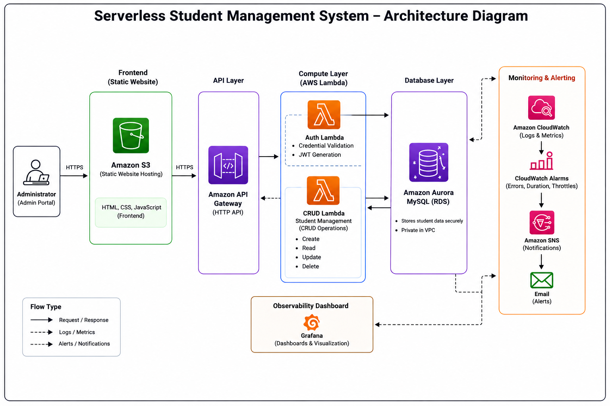
</p>

---

## 🚀 CI/CD Pipeline

The following diagram shows the automated deployment workflow using GitHub Actions.

<p align="center">
  
</p>

---
## Features

- Secure administrator login with JWT authentication and bcrypt password hashing.
- Student record management with Create, Read, Update, and Delete (CRUD) operations.
- RESTful API implementation using Amazon API Gateway and AWS Lambda.
- Serverless architecture built with AWS managed services.
- Static frontend hosting using Amazon S3.
- Secure data storage with Amazon Aurora MySQL.
- Real-time monitoring using Amazon CloudWatch and Grafana.
- CloudWatch Alarms with Amazon SNS email notifications.
- Automated deployment using GitHub Actions.
- Scalable and modular application design.


---

## Application workflow

The application follows a serverless request-response architecture using AWS managed services. The complete workflow is as follows:

### 1. Access the Application
- The administrator opens the application using the Amazon S3 static website URL.
- Amazon S3 serves the HTML, CSS, and JavaScript files to the user's browser.

### 2. User Authentication
- The administrator enters a username and password on the login page.
- The frontend sends an HTTP **POST** request to the **/login** endpoint exposed by Amazon API Gateway.

### 3. API Gateway Request Routing
- Amazon API Gateway receives the login request.
- The request is forwarded to the **Authentication Lambda** function.

### 4. Credential Validation
- The Authentication Lambda connects to Amazon Aurora MySQL.
- It retrieves the administrator's account details.
- The entered password is verified against the stored bcrypt hash.
- If the credentials are valid, the Lambda generates a JWT access token.
- The token is returned to the frontend as the authentication response.

### 5. Secure Session
- The frontend stores the JWT token securely.
- For every protected request, the frontend includes the token in the HTTP Authorization header.

```
Authorization: Bearer <JWT_TOKEN>
```

### 6. Student Management Operations
After successful authentication, the administrator can perform CRUD operations.

#### Create Student
- The frontend sends a **POST** request.
- API Gateway routes the request to the Student CRUD Lambda.
- The Lambda validates the JWT token.
- Student details are inserted into Aurora MySQL.
- A success response is returned.

#### View Students
- The frontend sends a **GET** request.
- API Gateway invokes the Student CRUD Lambda.
- The Lambda validates the JWT token.
- Student records are retrieved from Aurora MySQL.
- The records are returned as JSON and displayed in the application.

#### Update Student
- The frontend sends a **PUT** request.
- API Gateway forwards the request to the Student CRUD Lambda.
- The Lambda validates the JWT token.
- Student information is updated in Aurora MySQL.
- A success response is returned.

#### Delete Student
- The frontend sends a **DELETE** request.
- API Gateway routes the request to the Student CRUD Lambda.
- The Lambda validates the JWT token.
- The selected student record is removed from Aurora MySQL.
- A confirmation response is returned.

### 7. Database Operations
- Amazon Aurora MySQL securely stores student information and administrator credentials.
- All database interactions are performed through AWS Lambda functions.
- The frontend never communicates directly with the database.

### 8. Logging and Monitoring
- Every Lambda execution generates logs in Amazon CloudWatch Logs.
- CloudWatch collects metrics such as:
  - Invocations
  - Duration
  - Errors
  - Throttles
- API Gateway also publishes request count, latency, and HTTP error metrics.

### 9. Observability
- Grafana retrieves metrics from Amazon CloudWatch.
- Dashboards provide real-time visualization of:
  - Lambda performance
  - API Gateway metrics
  - Aurora MySQL metrics
  - Application health

### 10. Alerting
- CloudWatch Alarms continuously monitor critical metrics.
- When a threshold is exceeded (such as Lambda errors or high execution duration), CloudWatch triggers an Amazon SNS notification.
- Amazon SNS sends an email alert to the administrator.

### 11. Continuous Deployment
- Developers push code changes to the GitHub repository.
- GitHub Actions automatically executes the deployment workflow.
- Updated Lambda function code is deployed to AWS.
- The latest backend changes become available without manual deployment steps.
---
## API Endpoints

| Method | Endpoint | Description |
|---------|----------|-------------|
| POST | /login | Authenticate Administrator |
| GET | /students | Retrieve Student Records |
| POST | /students | Create Student |
| PUT | /students/{id} | Update Student |
| DELETE | /students/{id} | Delete Student |
---
## Monitoring & Observability

The application uses Amazon CloudWatch and Grafana to monitor system performance, application health, and operational metrics in real time.

### Amazon CloudWatch
- Collects Lambda execution logs.
- Monitors metrics such as Invocations, Duration, Errors, and Throttles.
- Tracks API Gateway Requests, Latency, 4XX Errors, and 5XX Errors.
- Configured with CloudWatch Alarms to detect abnormal application behavior.

### Amazon SNS
- Sends email notifications when CloudWatch Alarms are triggered.

### Grafana Dashboard
Provides real-time dashboards for monitoring:
- AWS Lambda metrics
- API Gateway metrics
- Aurora MySQL metrics
- Overall application health and performance
---
# 📸 Screenshots

## 🖥️ Application

### Login Page

<p align="center">
  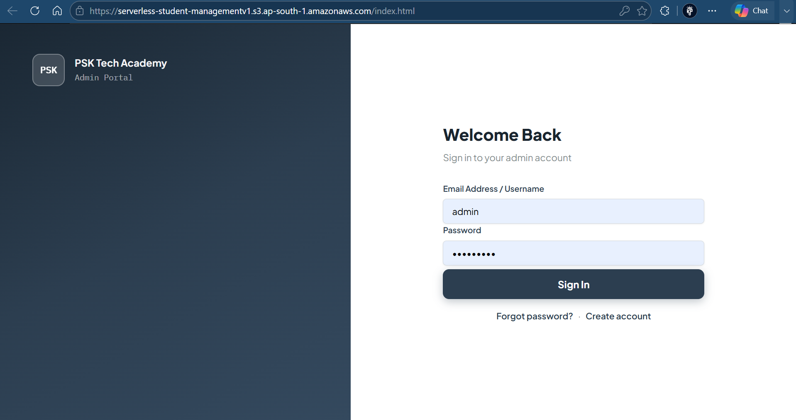
</p>

---

### Dashboard

<p align="center">
  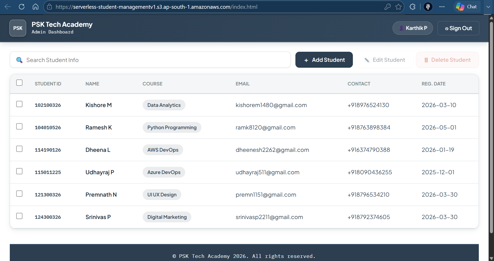
</p>

---

### Sign Up

<p align="center">
  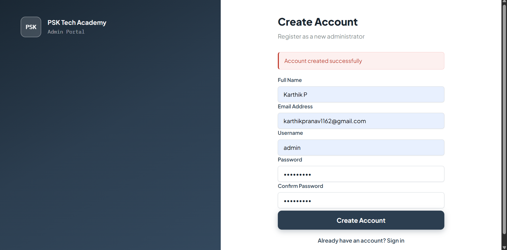
</p>

---

### Add Student

<p align="center">
  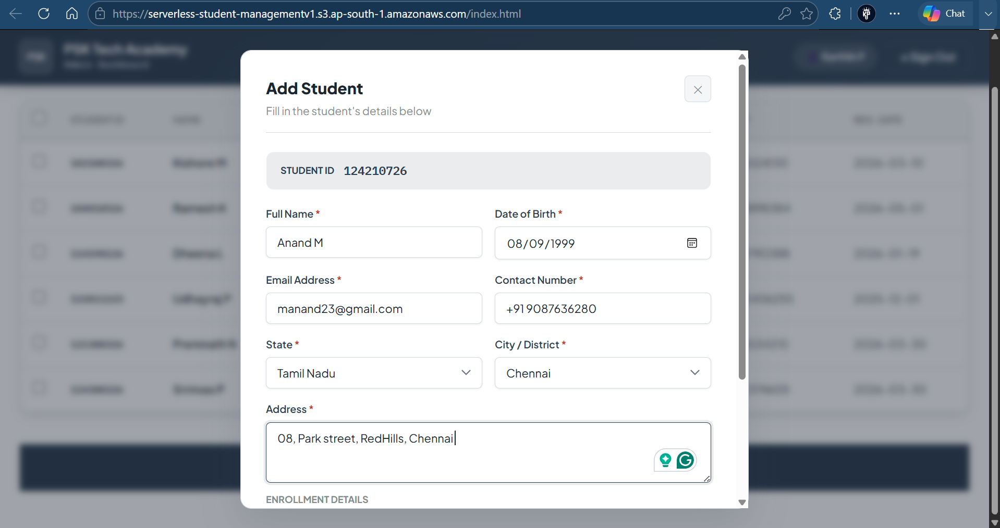
</p>

---

### Student Added Successfully

<p align="center">
  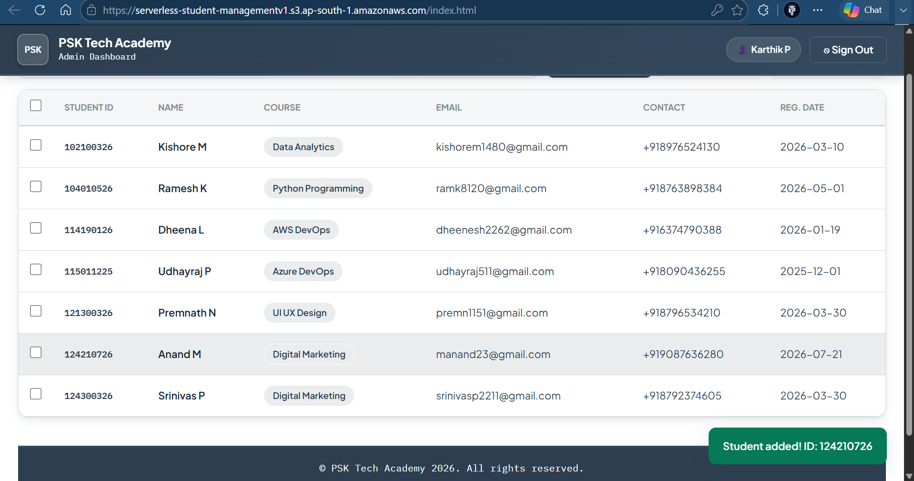
</p>

---

### Search Student

<p align="center">
  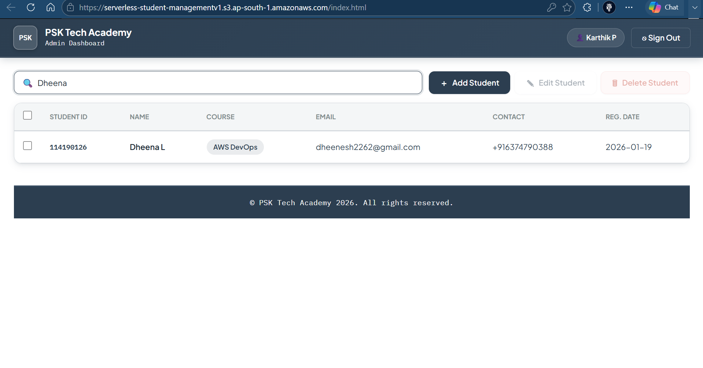
</p>

---

### Edit Student

<p align="center">
  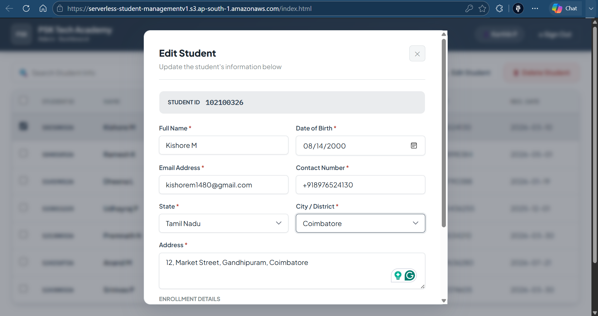
</p>

---

### Student Updated Successfully

<p align="center">
  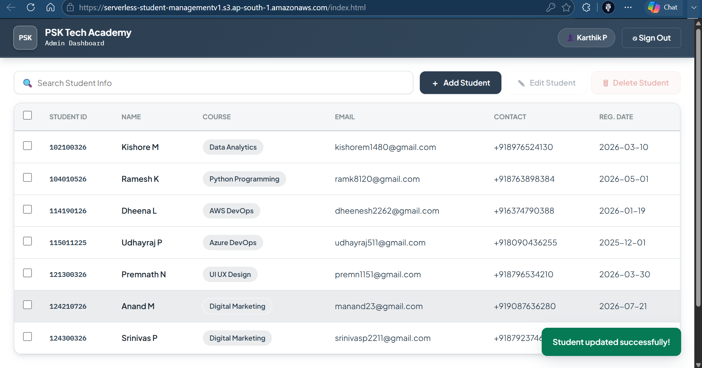
</p>

---

### Delete Student

<p align="center">
  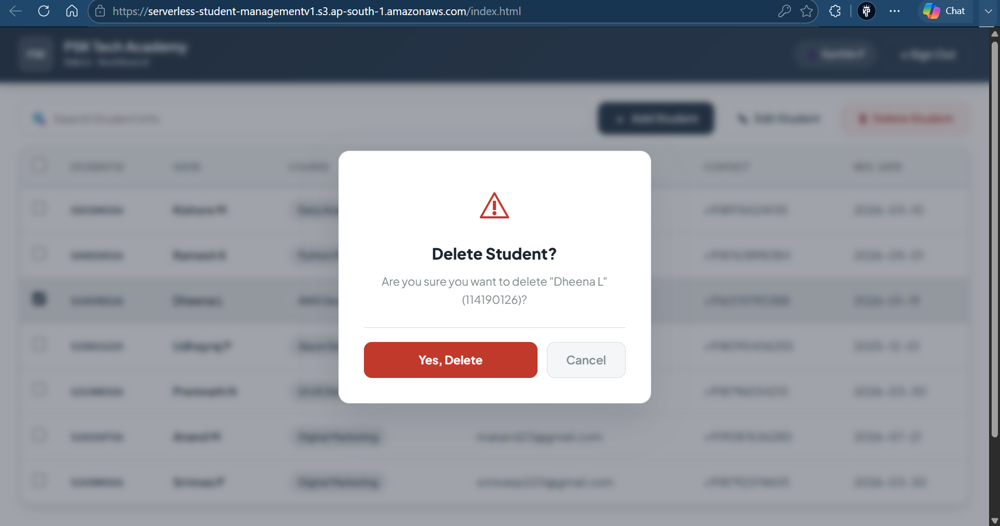
</p>

---

### Student Deleted Successfully

<p align="center">
  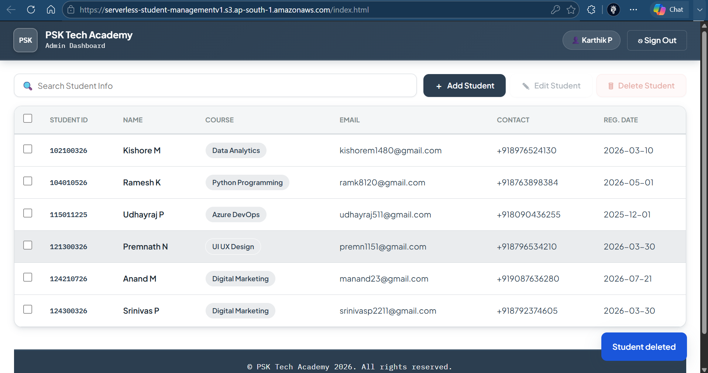
</p>

---

# ☁️ AWS Infrastructure

### Amazon S3 Static Website

<p align="center">
  
</p>

---

### API Gateway

<p align="center">
  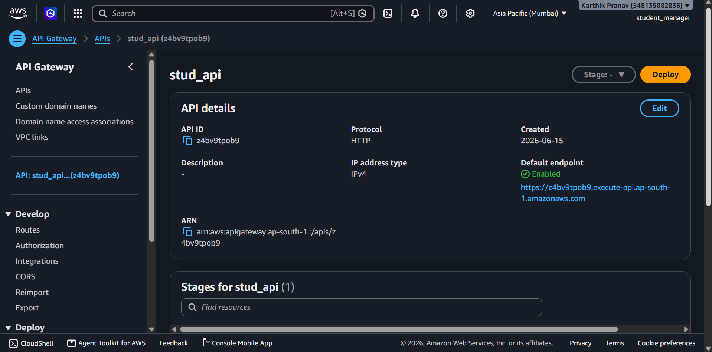
</p>

---

### AWS Lambda Functions

<p align="center">
  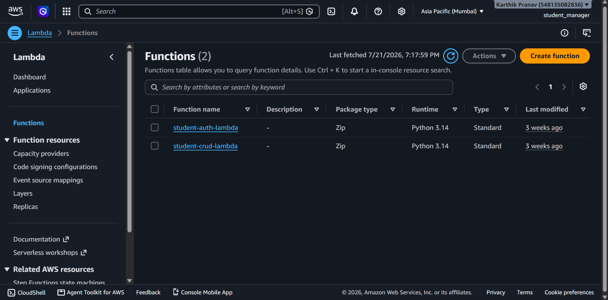
</p>

---

# 📊 Monitoring & Observability

### CloudWatch Dashboard

<p align="center">
  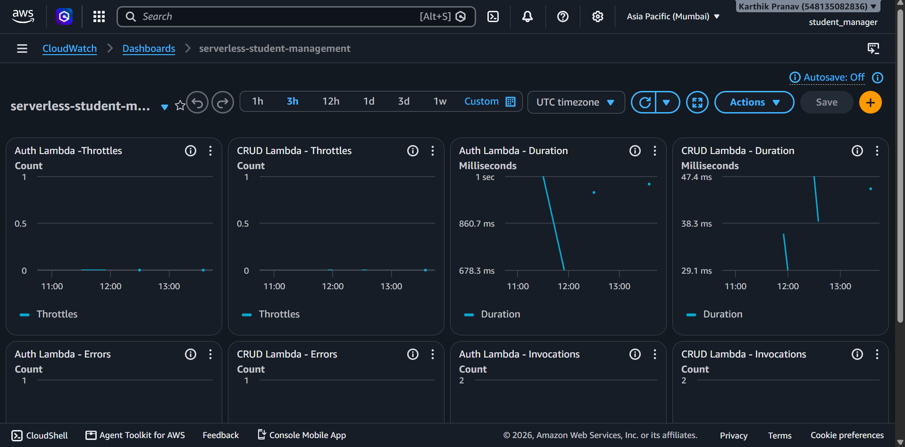
</p>

---

### CloudWatch Alarms

<p align="center">
  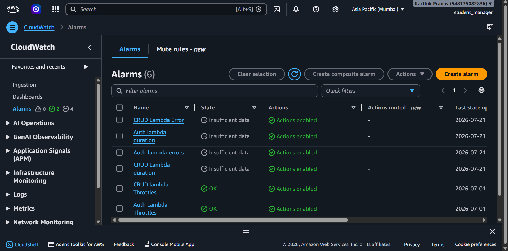
</p>

---

### Amazon SNS Notifications

<p align="center">
  
</p>

---

### Grafana Dashboard

<p align="center">
  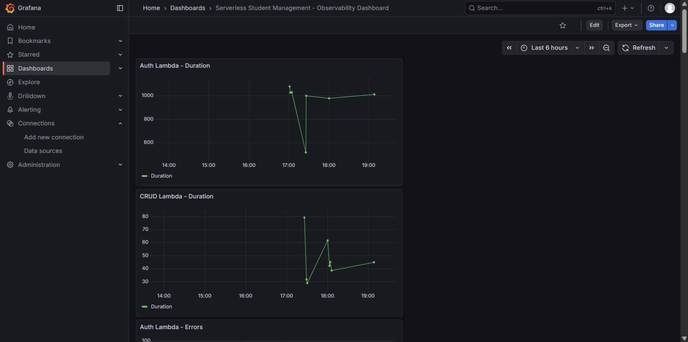
</p>

---

# 🚀 CI/CD

<p align="center">
  
</p>

---
## 📁 Project Structure

```text
SERVERLESS_PROJECT/
├── .github/
│   └── workflows/
│       └── deploy.yml
├── api-gateway/
├── architecture/
│   ├── Serverless-Architecture-Diagram.png
│   └── CICD-Pipeline-Diagram.png
├── database/
├── screenshots/
│   ├── Application/
│   ├── AWS/
│   ├── Monitoring/
│   └── cicd/
├── student-auth-lambda/
├── student-crud-lambda/
├── student-manager/
├── .gitignore
└── README.md
```
---

## Future Enhancements

- Develop dedicated Student and Trainer portals.
- Implement Role-Based Access Control (RBAC) for different user roles.
- Add search, filtering, and pagination for student records.
- Support file uploads using Amazon S3.
- Integrate email notifications for important events.
- Deploy the application with AWS CloudFront and a custom domain.
- Provision infrastructure using Terraform (Infrastructure as Code).
- Add automated testing to the CI/CD pipeline.
- Implement Multi-Factor Authentication (MFA) for enhanced security.
- Expand monitoring with custom CloudWatch dashboards and alerts.
---

## Author

**Karthik P**

- GitHub: https://github.com/KarthikPranav1162
- LinkedIn: https://linkedin.com/in/karthikpranav/
---

## 📄 License

This project is licensed under the MIT License.

[MIT](https://choosealicense.com/licenses/mit/)

